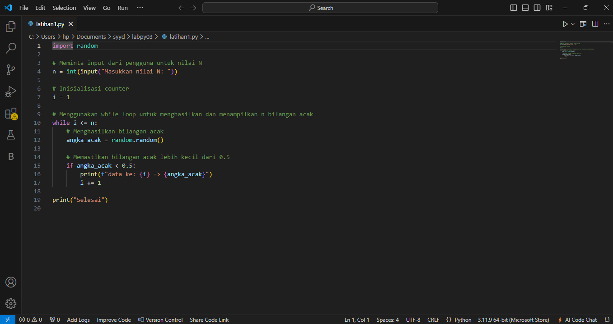
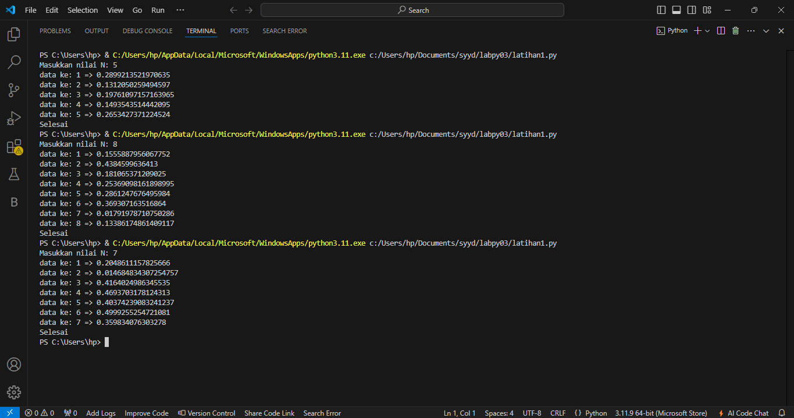

# labpy03.
Nama : Fauzan Giri Wardana 

Nim : 312410535 

Kelas : TI.24.A.5 

Mata kuliah : Bahasa pemrograman 

## `Latihan1: Angka random`
### Alur Algoritma Latihan1 :
1. Mulai Program :
    - Import modul random.
    - Minta input dari pengguna untuk nilai n (jumlah bilangan acak yang ingin ditampilkan).
 2. Inisialisasi Variabel :
    - Inisialisasi variabel count dengan nilai 0 untuk menghitung jumlah bilangan acak yang sudah dihasilkan.
 3. Looping:
    - Gunakan loop while untuk terus menghasilkan bilangan acak hingga jumlah yang diinginkan tercapai (i < n).
 4. Menghasilkan Bilangan Acak:
    - Di dalam loop, gunakan random.random() untuk menghasilkan bilangan acak antara 0 dan 1.
 5. Memeriksa Bilangan Acak:
    - Periksa apakah bilangan acak yang dihasilkan kurang dari 0.5.
      > Jika ya, tambahkan nilai i dengan 1 dan cetak bilangan tersebut dengan format “Data Ke {i} = {random_number}”.
 6. Akhir Looping:
    - Ulangi langkah 4 dan 5 hingga count mencapai nilai n.
 7. Selesai:
    - Program selesai setelah menampilkan n bilangan acak yang kurang dari 0.5.
   
  ### Program python
  
### Hasil eksekusi program 
ini hasil eksekusi program python diatas

## `Latihan2: Laba`
### Alur Algoritma Latihan2 :
 1. Mulai Program:
    - Inisialisasi modal awal sebesar Rp 100.000.000.
    - Buat daftar keuntungan_bulanan yang berisi persentase keuntungan untuk setiap bulan.
 2. Inisialisasi Variabel:
    - Inisialisasi total_keuntungan dengan nilai 0 untuk menyimpan total keuntungan selama 8 bulan.
 3. Looping:
    - Gunakan loop for untuk iterasi dari bulan 1 hingga bulan 8.
 4. Menghitung Keuntungan Bulanan:
    - Di dalam loop, hitung laba bulan ini dengan mengalikan modal awal dengan persentase keuntungan bulan tersebut.
    - Tambahkan laba bulan ini ke total_keuntungan.
 5. Menampilkan Keuntungan Bulanan:
    - Cetak keuntungan untuk bulan tersebut.
 6. Akhir Looping:
    - Ulangi langkah 4 dan 5 untuk setiap bulan hingga bulan ke-8.
 7. Menampilkan Total Keuntungan:
    - Setelah loop selesai, cetak total keuntungan selama 8 bulan.
8. Selesai:
    - Program selesai.
